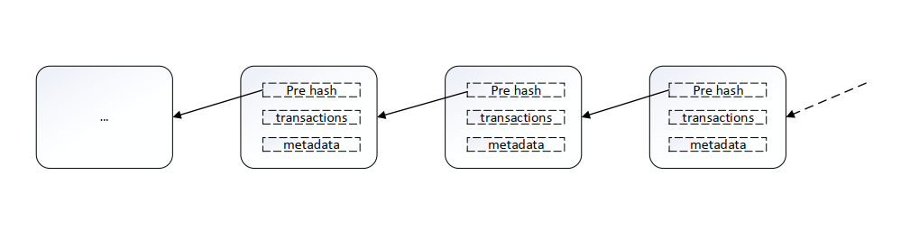
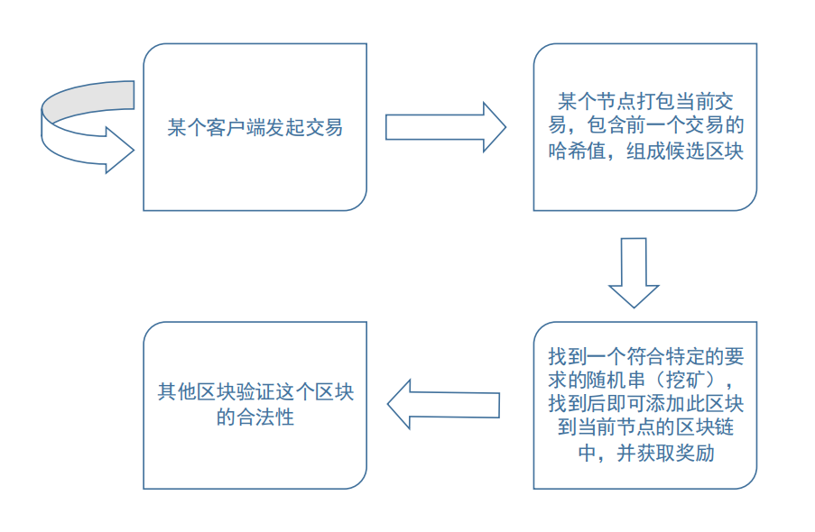
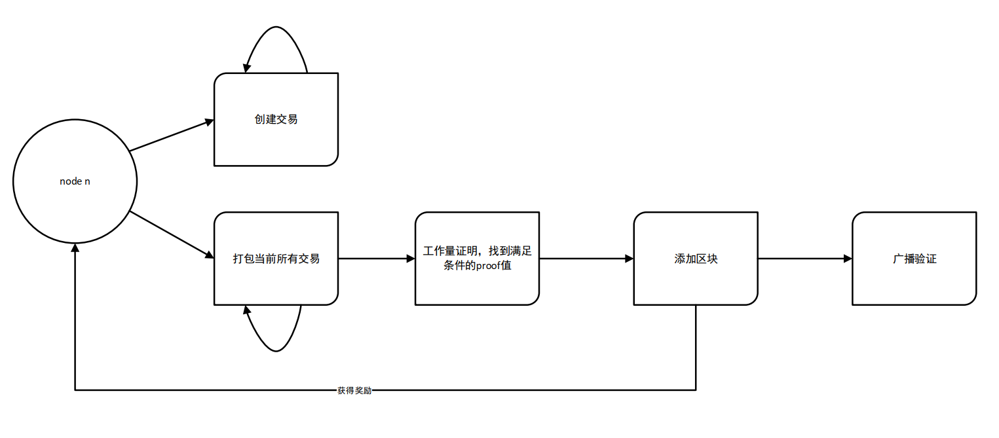
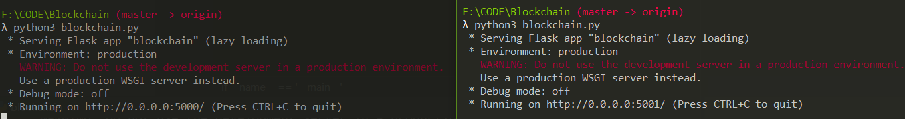
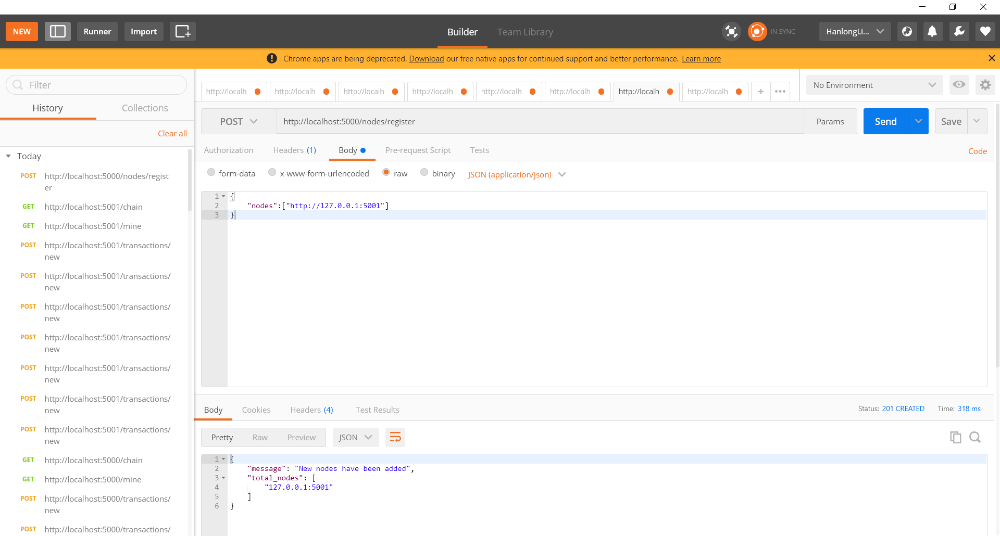
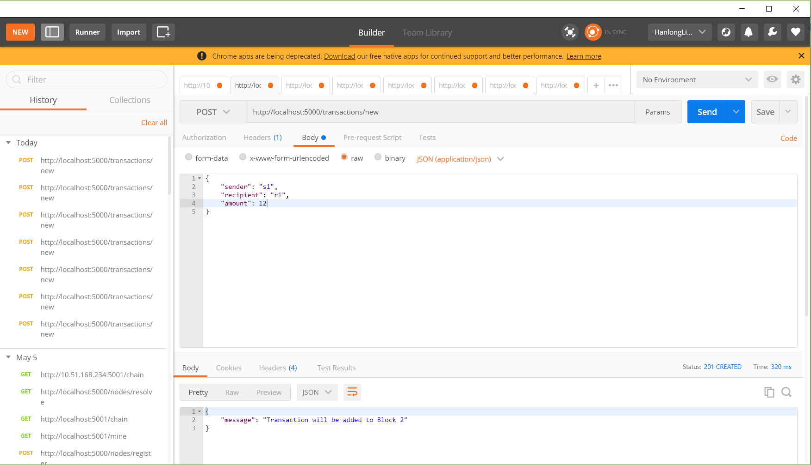
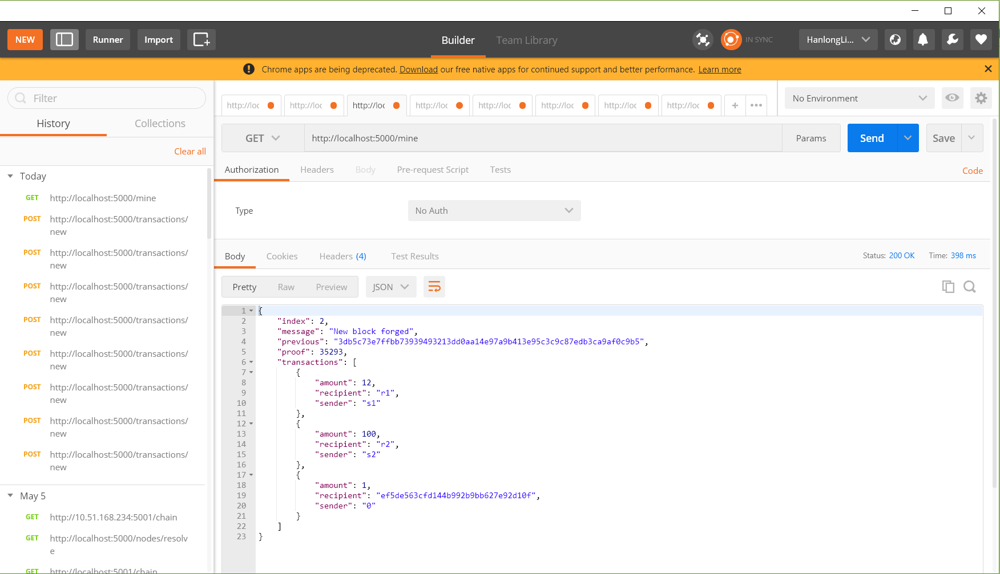
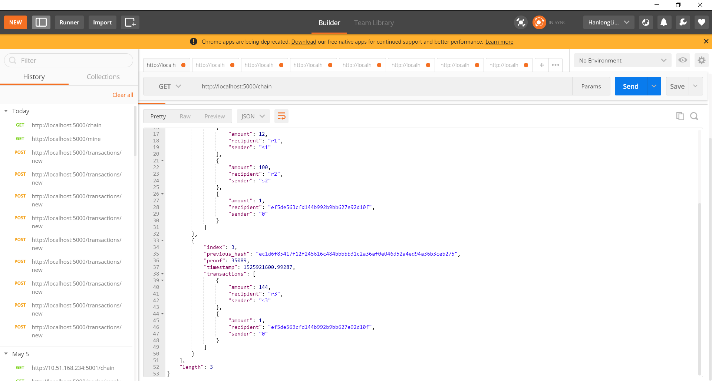
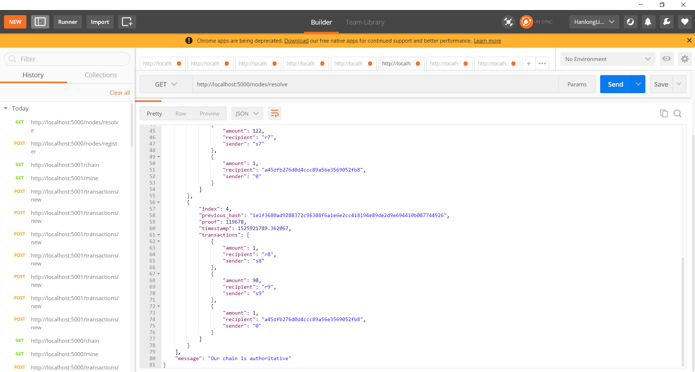

# 区块链技术原理与实践报告  
&emsp;&emsp;这篇文章参考了一些区块链的书和博文，参考书上的原理定义以及一些代码,特别是杨宝华老师的《区块链原理、设计与应用》一书，本文中的定义原理等方面都引用了书中的内容。

&emsp;&emsp;由于格式转换的问题，查看原文格式请查看html格式文件或者点击：[原文链接](https://github.com/HanlongLiao/NIS-Blockchain/blob/master/report.md)    

## 一、区块链的定义与原理

### 1. 定义

&emsp;&emsp;公认的最早的区块链的描述性的文章在中本聪所撰写的文章《Bitcoin: A Peer-to Peer Electronic Cach System》，但是这篇文献的重点在于讨论比特币系统，实际上并没有明确提出区块链的定义与概念，本文中指出，区块链是用于记录比特币交易账目历史的数据结构。  
&emsp;&emsp;此处也存在一个认识误区：  
> 区块链不等于比特币。虽然说区块链的基本思想诞生于比特币的设计中，但是发展到今天，比特币和区块链已经俨然成为了两个不太相关的技术，前者更关于实验性意义，后者则从技术层面探讨和研究可能带来的商业系统价值。  

&emsp;&emsp;另外，Wikipedia上给出的定义中，将区块链类比为一种分布式数据库技术，通过维护数据块的链式结构，可以维持持续增长的、不可篡改的数据记录。但是需要指出的是，区块链不等于数据库。虽然区块链也可以用来存储数据，但是其要解决的是多方互信的问题。当然，现在已有的区块链系统中，数据库相关的技术十分关键，直接决定了区块链系统的吞吐性能。  
&emsp;&emsp;区块链技术最早的应用出现在比特币项目中。作为比特币背后的分布式记账平台，在无集中管理的情况下，比特币稳定运行了八年时间，支持了海量的交易记录，并且从未出现过严重漏洞，这些都与巧妙的区块链结构分不开。  
&emsp;&emsp;区块链技术自身任然在飞速发展中，目前相关规范和标准还在进一步成熟中。区块链并非一门万能的颠覆性技术。作为融合多项已有技术而出现的新事物，区块链跟现有技术的关系是一脉相承的。它在解决多方合作和可信处理上向前走了一步。但是并不意味着它是万能的。在很长的一段时间里，区块链所适用的场景仍需不断摸索。并且跟已有的系统也必然存在长期的合作共存的关系。  

### 2. 基本原理  
&emsp;&emsp;区块链的基本原理理解起来并不复杂。区块链包括三个基本概念：
- 交易(transsction)：一次对账本的操作，导致账本状态的一次改变，如添加一条转账记录；
- 区块(block)：记录一段时间内发生的所有交易和状态结果，是对当前账本的一次共识。
- 链(chain):由区块按照发生顺序串联而成，是整个账本状态变化的日志记录。 

&emsp;&emsp;如果把区块链作为一个状态机，则每次交易就是试图改变一次状态，而每次共识产生的区块，就是参数者对于区块链中交易导致状态改变的结果进行确认。  
&emsp;&emsp;在实现上，首先假设存在一个分布式的数据记录账本，这个账本只允许添加、不允许删除。账本底层的基本结构是一个线性的链表，这也是其名字“区块链”的由来。链表由一个个区块链组成，后继区域记录前导区块的哈希值(pre hash)。新的数据要加入，必须放到一个新的区块中。而这个块(以及块里的交易)是否合法，可以通过计算哈希值的方式快速检测出来。任意维护节点都可以提议一个新的的合法区块，然而必须经过一定的共识机制来对最终得选择的区块达成一致。图-1对区块链的数据结构有一个比较好的描述。
 
<center><font size=1>图-1</font></center>

## 二、工作过程与实现  

### 1. 工作过程  

&emsp;&emsp;下面以比特币为例说明区块链的基本的工作过程（工作过程在后文的代码中有很好的体现，每个节点的工作过程可以参照可以参照图-3）  
&emsp;&emsp;首先，比特币的客户端发起一项交易，广播到比特币网络中并等待确认。网络中的节点会将一些受到的等待确认的交易打包在一起（此外还要包括前一个区块头部的哈希值等信息），组成一个候选区块，然后，试图找到一个nonce串（随机串）放到区块链里，使得候选区块的哈希结果满足一定条件（比如小于某个值）。这个nonce串的查找需要一定的时间去进行尝试计算。  
&emsp;&emsp;一旦节点算出来满足条件的nonce串，这个区块在格式上就被确认为合法了，就可以尝试在网络中将它广播出去。其他节点收到候选区块，进行验证，发现确实符合约定条件了，就承认这个区块是一个合法的新区块，并添加到自己维护的区块链上。当大部分节点都将区块添加到自己维护的区块链结构上时，该区块被网络接受，区块链中所包括的交易也就得到承认。如图-2所示。  
<div align=center>
  
</div>  
<center><font size=1>图-2</font></center>  
&emsp;&emsp;当然，在实现上还有很多额外的细节。这里边比较关键的步骤有两个：一个是完成对一笔交易的共识（创建区块结构）；一个是新的区块添加到区块链上，被大家认可，确保未来无法被篡改。  
&emsp;&emsp;比特币的这种基于算力寻找nonce串的共识机制称为工作量证明（Proof of Work, PoW）。目前，要让哈希结果满足一定条件，并无已知的快速启发式算法，只能进行尝试性的暴力计算。尝试的次数越多（工作量越大），算出来的概率越大。  
&emsp;&emsp;通过调节对于哈希结果的限制，比特币网络控制平均约10分钟产生一个合法区块。算出区块的节点将得到区块中所有交易的管理费用和协议固定发放的奖励费（目前是12.5比特币，每4年减半），这个基三新区快的过程俗称挖矿。  
&emsp;&emsp;当然，以上只是最为基本的区块链的原理，在实际运用过程中还有很多的细节与难题需要处理。比如个人隐私的保护，交易的性能，分布式共识的改进，系统的可扩张性以及数据库的使用。  

### 2. 区块链的简单实现

&emsp;&emsp;通过借鉴一些网上现有的实现方法与理解，我自己实现了一个基本的区块链模型。这个模型实现了添加交易，添加区块，共识的解决区块链长度冲突等基本的操作，但是也有一些功能没有实现，比如候选区块的验证，数据存储等。下面我就代码进行简单的说明。  
每一个节点的基本的流程如图-3所示：  
  
<center><font size=1>图-3</font></center>  

创建交易与添加区块的过程如下  
```python
    class Blockchain(object):
    def __init__(self):
        self.chain = []
        self.current_transaction = []

        # Create the genesis block
        self.new_block(previous_hash=1, proof=100)

    def new_block(self, proof, previous_hash=None):
        """
         Create a new block, and adds it to chain
        :param proof: <int> The proof given by the proof of work algorithm
        :param previous_hash: (Optional) <str> Hash of previous block
        :return: <dict> New block
        """

        block = {
            'index': len(self.chain) + 1,
            'timestamp': time(),
            'transactions': self.current_transaction,
            'proof': proof,
            'previous_hash': previous_hash or self.hash(self.chain[-1])
        }

        # Request the current list of transaction
        self.current_transaction = []

        self.chain.append(block)
        return block

    def new_transaction(self, sender, recipient, amount):
        """
        Create a new transaction to go into the next mined Block
        :param sender: <str> Address of the Sender
        :param recipient: <str> Address of the recipient
        :param amount: <int> Amount
        :return: <int> The index of the block that will hold this transaction
        """

        self.current_transaction.append({
            'sender': sender,
            'recipient': recipient,
            'amount': amount
        })

        return self.last_block['index'] + 1

    @staticmethod
    def hash(block):
        """
        Create a SHA-256 hash of a block
        :param block: <dict> Block
        :return: <str>
        """

        # we must make sure that the dictionary is ordered, or we'll have inconsistent hashes
        block_string = json.dumps(block, sort_keys=True).encode()
        return hashlib.sha256(block_string).hexdigest()

    @property
    def last_block(self):
        return self.chain[-1]
```
<center size=1><font size=1>代码-1</font></center>  

&emsp;&emsp;初始时刻需要有初始化两个个列表，用于保存当前的交易与区块链表。新建的交易包括三项，sender, recipient和amount三项，每个区块包块四项，区块的索引号index,时间戳 timestamp,包含的交易 transaction,验证号 proof和区块链中前一个区块的哈希值previous_hash。初始时刻已经在区块链中放入了一个区块。在前边的原理中已经提高一个节点如何才能完成挖矿，得到奖励，将当前的区块加到自己的区块链中。这里的每一个区块都会有一个proof，“挖矿”过程的进行就是找到当前需要添加的区块的proof,如果找到，则说明这个区块没有问题，可以添加到区块链中。  
寻找的方法即通过上述代码中的求前一个区块的proof值与当前的一个任意输入的proof值得hash值，如果满足了指定的条件，则这个区块的proof值就确定下来，区块可以添加到区块链当中。  
代码如下：
```python
class Blockchain(object):
# ...
 def proof_of_work(self, last_proof):
        """
        Simple proof of work algorithm
        - Find a number p', such that hash(pp') contains leading 4 zeroes, where p is the previous p'
        - p is the previous proof, and p' is the new proof
        :param last_proof: <int>
        :return: <int>
        """

        proof = 0
        while self.valid_proof(last_proof, proof) is False:
            proof += 1

        return proof

    @staticmethod
    def valid_proof(last_proof, proof):
        """
       Validates the proof: Does hash(last_proof, proof) contain 4 leading zeroes
        :param last_proof:<int> Previous proof
        :param proof:<int> Current proof
        :return:<bool> True if correct, False if not
        """

        guess = f'{last_proof}{proof}'.encode()
        guess_hash = hashlib.sha256(guess).hexdigest()
        return guess_hash[:4] == '0000'
# ...
```
<center><font size=1>代码-2</font></center>

&emsp;&emsp;验证的方法是使得输入的proof值与前一个区块的proof值连接的字符串的hash值的前四位是“0000”,则是符合条件的proof值，当然这里可以使用任意的其他验证方法，此处我直接参考了博客中的验证方法。
&emsp;&emsp;以上是整个实现过程的核心代码，还有一些实现的细节，不再赘述。下面再使用Flask框架和postman来进行演示：  

```python
app = Flask(__name__)

# Generate a globally unique address for this node
node_identifier = str(uuid4()).replace('-', '')

# Instantiate the blockchain
blockchain = Blockchain()


@app.route('/mine', methods=['GET'])
def mine():
    # We run the proof of work algorithm to get the next proof
    last_block = blockchain.last_block
    last_proof = last_block['proof']
    proof = blockchain.proof_of_work(last_proof)

    # We must receive a reward for finding the proof
    # The sender is "0" to signify that this node has mined a new coin
    blockchain.new_transaction(
        sender="0",
        recipient=node_identifier,
        amount=1
    )

    # Forge the new block by adding it to the chain
    block = blockchain.new_block(proof)

    response = {
        'message': "New block forged",
        'index': block['index'],
        'transactions': block['transactions'],
        'proof': block['proof'],
        'previous': block['previous_hash']
    }

    return jsonify(response), 200


@app.route('/transactions/new', methods=['POST'])
def new_transaction():
    values = request.get_json()

    # Check that the required fields are in the POST'ed data
    required = ['sender', 'recipient', 'amount']
    if not all(k in values for k in required):
        return 'Messing values', 400

    # Create a new Transaction
    index = blockchain.new_transaction(values['sender'], values['recipient'], values['amount'])

    response = {'message': f'Transaction will be added to Block {index}'}
    return jsonify(response), 201


@app.route('/chain', methods=['GET'])
def full_chain():
    response = {
        'chain': blockchain.chain,
        'length': len(blockchain.chain)
    }

    return jsonify(response), 200
```
<center><font size=1>代码-3</font></center>  
使用Flask框架建立了三条路径，作用如下:  

>1. @app.route('/transactions/new', methods=['POST'])  
用于建立新的交易，返回201
>2. @app.route('/mine', methods=['GET'])  
用于添加区块，返回200  
>3. @app.route('/chain', methods=['GET'])  
用于查看当前的区块链信息，返回200  
&emsp;&emsp;到现在为止，已经基本实现了交易的添加与区块的添加的功能，但是还没有说明是如何实现分布式的共识的功能的，此处并没有实现对于候选区块的广播功能，只是实现了注册不同的用户，各自维护自己的区块链，并且一个节点可以通过注册的节点来同步自己的区块链，且是根据拥有最长区块链的节点来更新自己的区块链的功能，核心的代码如下：
```python
class Blockchain(object):
    def __init__(self):
        self.chain = []
        self.current_transaction = []

        # Create the genesis block
        self.new_block(previous_hash=1, proof=100)
        self.nodes = set()

    def register_node(self, address):
        """
        Add a new node to the list of nodes
        :param address: <str> Address of node. Eg. "http:192.168.0.5:5000"
        :return: None
        """

        parsed_url = urlparse(address)
        self.nodes.add(parsed_url.netloc)

    # ...
        def resolve_conflicts(self):
        """
        This is our Consensus Algorithm, it resolves conflicts
        by replacing our chain with the longest one in the network.
        :return: <bool> True if our chain was replaced, False is not
        """

        neighbours = self.nodes
        new_chain = None

        # We're only looking for chains longer than ours
        max_length = len(self.chain)

        # Grab and verify the chains from all the nodes in our network
        for node in neighbours:
            response = requests.get(f'http://{node}/chain')

            if response.status_code == 200:
                length = response.json()['length']
                chain = response.json()['chain']

                # Check if the length if longer and the chain is valid
                if length > max_length and self.valid_chain(chain):
                    max_length = length
                    new_chain = chain

        # Replace our chain if we discovered a new, valid chain longer than ours
        if new_chain:
            self.chain = new_chain
            return True

        return False


    # ...
```
<center><font size=1>代码-4</font></center>
&emsp;&emsp;其中，register_node()用于注册新的节点，resolve_conflict用于解决各个节点的区块链长度不一致的问题，然后相应的加上flake路径：  

```python
@app.route('/nodes/register', methods=['POST'])
def register_nodes():
    # values_j = r'request.get_json()'
    # values = json.loads(values_j)
    #
    values = request.get_json()
    print(type(values))
    # dict(values)
    nodes = values.get('nodes')
    if nodes is None:
        return "Error: Please supply a valid list of nodes", 400

    for node in nodes:
        blockchain.register_node(node)

    response = {
        'message': 'New nodes have been added',
        'total_nodes': list(blockchain.nodes)
    }

    return jsonify(response), 201


@app.route('/nodes/resolve', methods=['GET'])
def consensus():
    replaced = blockchain.resolve_conflicts()

    if replaced:
        response = {
            'message': 'Our chain was replaced',
            'new_chain': blockchain.chain
        }
    else:
        response = {
            'message': 'Our chain is authoritative',
            'chain': blockchain.chain
        }

        return jsonify(response), 200
```
&emsp;&emsp;其中，@app.route('/nodes/register', methods=['POST']) 用于注册节点，
@app.route('/nodes/resolve', methods=['GET'])用于解决冲突。
下面，适用postman简单地演示结果：
我在此处没有使用两台电脑做实验，而是使用同一台电脑的不同节点进行了简单的功能测试。  
首先开启服务器：  
<div align=center>

</div>
<center><font size=1>图-4</font></center>
然后在postman中分别建立新的交易和节点，其中5000端口建立连个区块的区块链，5001端口建立有3个区块的区块链，如下图所示：  
  
<center><font size=1>图-5</font></center>  
首先需要将5001端口所表示的节点进行注册，如图-5所示。
  
<center><font size=1>图-6</font></center>  
图-6表示在5000端口建立新的交易。
  
<center><font size=1>图-7</font></center>  
图-7表示在5000端口，添加区块，即挖矿的过程。  
  
<center><font size=1>图-8</font></center> 
图-8表示在5000端口查看这个节点的当前区块链，5001的端口的所有操作均和5000端口保持一致，但是在5001端口所表示的节点多建立一个区块，目的在于后面实现 
  
<center><font size=1>图-9</font></center> 
图-9是调用@app.route('/nodes/resolve', methods=['GET'])用于两个节点的区块链长度不一致的冲突。

## 三、实践感想  
&emsp;&emsp;我通过这次的实践，了解了区块链和比特币的基本概念，并且通过自己动手和借鉴基本实现了一个简单的区块链的模型。但是模型中有很多区块链的细节的技术是没有实现的，这有待后续的进一步的补充与完善。  
&emsp;&emsp;接下来我会再去看一些书籍和动手实践一下，再细致地了解区块链中的实现细节。

